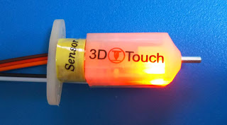

# touch_probe
Raspberry Pi に接続したタッチプローブ (例: 3DTouch) を操作する Python モジュールです。

通常、タッチプローブは 3D プリンターの制御基板に接続しますが、調べたところ Raspberry Pi に接続しても動きそうだったのでこのモジュールを書きました。

Raspberry Pi に接続したタッチプローブで 3D プリンターのベッドの凸凹を検出し、OctoPrint API 経由で 3D プリンターのオートレベリングをするために使っています。

ただし、これは特殊なオートレベリングの方法なので通常の方法 (3D プリンターの制御基板に直接タッチプローブを接続する方法) でオートレベリングをしようとしている方には参考にはならないです。

<br/>


<br/>

# 動作確認環境

- Raspberry Pi 3 Model B
- Raspbian GNU/Linux 9.9 (stretch)
- Python 3.5.3
- Touch Probe: 3DTouch

<br/>

# 3DTouch の配線及び PWM について

本家 BLTouch は触ったことが無いので手元にある 3DTouch について記載しています。

3Dtouch の配線や PWM を調べたところ以下のようです。

詳しくは「[Raspberry Pi の GPIO で 3DTouch を直接操作](http://ne-zu-ppo.blogspot.com/2019/06/raspberry-pi-gpio-3dtouch.html)」 を参照して下さい。

<br/>

## 配線

<br/>



<br/>

- サーボ用と思われるケーブル 3本

    | ケーブルの色 |                   |
    |--------------|-------------------|
    | 茶色         | GND               |
    | 赤色         | +5V               |
    | 橙色         | control signal    |

<br/>

- タッチスイッチ用と思われるケーブル 2本

    | ケーブルの色 |           |
    |--------------|-----------|
    | 黒色         | GND       |
    | 白色         | Z min     |

<br/>

## PWM

<br/>

- PWM 周波数: 50Hz

- 各 PWM Duty比

    | 3DTouch の動作 | Duty 比 |
    |----------------|---------|
    | Push-pin Down  | 0.035   |
    | Push-pin Up    | 0.075   |
    | Self-test      | 0.09    |
    | Alarm Release  | 0.11    |

<br/>

# touch_probe モジュールの使い方

## 配線

<br/>

今回は以下のように配線しています。ケーブルの色は 3DTouch のロットにより異なるかもしれないので注意して下さい。

<br/>

- サーボ用と思われるケーブル 3本

    | ケーブルの色          | ラズパイの接続先 |
    |-----------------------|------------------|
    | 茶色 (GND)            | GND              |
    | 赤色 (+5V)            | +5V              |
    | 橙色 (control signal) | 今回は GPIO 18   |

<br/>

- タッチスイッチ用と思われるケーブル 2本

    | ケーブルの色  | ラズパイの接続先 |
    |---------------|------------------|
    | 黒色 (GND)    | GND              |
    | 白色 (Z min)  | 今回は GPIO 23   |

<br/>

## pigpiod を起動

<br/>

```
$ sudo pigpiod
```

<br/>

## Python での使い方

<br/>

touch_probe モジュールの TouchProbe クラスをインポート

```
>>> from touch_probe import TouchProbe
```

<br/>

今回の 3DTouch 配線の PWM、SW の接続先 GPIO を引数に指定して TouchProbe オブジェクト作成

```
>>> tp = TouchProbe(gpio_hw_pwm=18, gpio_sw=23)
```

<br/>

3DTouch を操作

```
>>> # プッシュピンを下げる
>>> tp.pp_down()

>>> # プッシュピンを上げる
>>> tp.pp_up()

>>> # プッシュピンが押されたかどうかタッチフラグを確認
>>> tp.is_touched
False

>>> # タッチフラグをクリアー
>>> tp.reset_touched()
```
